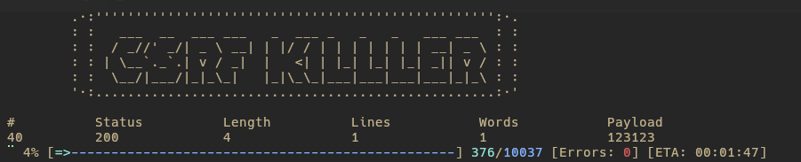

## What is `csrf_killer`?

`csrf_killer` is a tool designed to exploit Cross-Site Request Forgery (CSRF) defenses. Currently, it focuses on CSRF tokens, but I plan to add more features as I discover them through pentesting or receive suggestions via pull requests. The issue with CSRF tokens is that they often make fuzzing, testing, and other tasks cumbersome — in many cases, these tokens are unnecessary 🙀. This tool aims to simplify life by automating token handling, especially as more websites implement CSRF tokens everywhere.

## Installation

### Manual

```bash
git clone https://github.com/TinajaStyle/csrf_killer && cd csrf_killer && cargo build --release
```

You can find the binary in the target/release/ directory.

### Precompiled binaries?

Yes, precompiled binaries will be available soon. I plan to set up a GitHub workflow to automate the build process.

## Usage

To get started, you need to specify two URLs: one to retrieve the token(s) and one to exploit the vulnerability.

```bash
csrf_killer -c 'http://127.0.0.1/get-csrf' -u 'http://127.0.0.1/login'
```

Next, define the token using the -t flag. Use a double == to separate the token's attributes: token_name==type==regex.

- token_name: The field name where the token will be sent.
- type: The content type of the token (e.g., json, form, query).
- regex: The regular expression to extract the token from the specified URL.

Note: You can include multiple tokens by passing the -t flag multiple times.

```bash
csrf_killer -c 'http://127.0.0.1/get-csrf' -u 'http://127.0.0.1/login' -t 'token==json==_token=(.*?)<'
```

Tip: The regex can use capture groups, making it ideal for matching tokens within complex structures. For example, use (.*?) to capture the desired part of the token.

### Modes (currently 2 available)

- #### Brute Force

This mode works similarly to a web fuzzer. You place a keyword (FUZZ) in the URL or POST data, and it will substitute each line of a wordlist in place of FUZZ. If a token is present, it will be handled accordingly.

```bash
csrf_killer -c 'http://127.0.0.1/get-csrf' -u 'http://127.0.0.1/login' -t 'token==json==_token=(.*?)<' --brute-force -w some_dict.txt --data-post '{"username": "admin", "password": "FUZZ"}' --data-type "json"
```

Note: This is useful not only for pentesting but also for situations where you want to test the load a login form can handle, even when a token is used to prevent XSS.

- #### Upload Files

In this mode, you can attempt to upload multiple files to a URL protected by a token. You need to specify the field name where the files will be uploaded and provide a file that contains the file paths (one per line). This is designed for mass file uploads, but I plan to add a --repeat argument in the future to upload a single file multiple times.


```bash
csrf_killer -c 'http://127.0.0.1/get-csrf' -u 'http://127.0.0.1/login' -t 'token==json==_token=(.*?)<' --upload-files --file-paths files.txt --field-name "upload_file"
```

### The server's response statistics will be shown, and you can easily filter them (see --help).
